# Clevernet - flexiWAN installation guide

## Scope
This guide will walk you through the installation process for an accelerated
SD-WAN solution enabled by both Clevernet and flexiWAN technologies. Both
components are deployable as Virtual Network Functions - VNFs - in a variety of
environments (public cloud platforms, private clouds and datacenters managed
with different hypervisor technologies, embedded virtual CPEs, etc...). The
Clevernet VNF is usually called Clevernet Virtual Appliance (CVA). The flexiWAN
software deployed in an Ubuntu VM is called flexiEdge. For this walk-through we
will use the AWS public cloud environment to demonstrate the installation
process of two sites connected through the combination of CVA and flexiEdge.

## Topology and Architecture
For simplicity we will show a topology diagram for a two-site deployment. In
this scenario we will use flexiEdge to simplify the connection of the sites
through its embedded VPN, while enhancing the end-to-end performance thanks to
Clevernet Boost. A typical deployment of this kind needs two VMs for each site,
with Clevernet deployed closer to the LAN hosts and flexiEdge chained with
Clevernet and acting as VPN gateway connecting the sites.

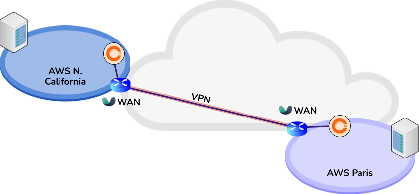

Both VMs should have two virtual network interface cards (vNIC) and should be
service chained so that the the WAN interface of the CVA is connected to the LAN
interface of the flexiEdge instance. The WAN interface of flexiEdge is then used
to route incoming and outgoing encrypted traffic of an established IPsec tunnel
through the WAN access link.

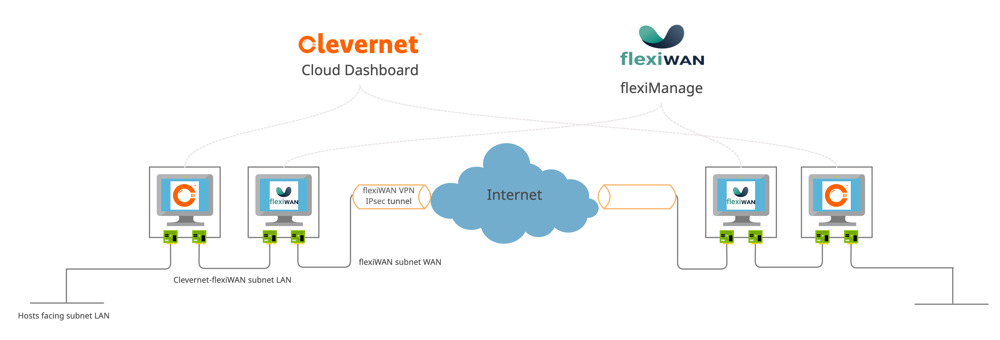

## Requirements
### CVA
The CVA requirements vary based on the access link capacity, the number of
handled flows and packets per second, and the set of features enabled. Deploying
the CVA together with flexiEdge means that the Clevernet VM does not need to
encapsulate and perform encryption of the IPsec tunnels, allowing for high
values of throughput with low resource requirements. The following table is
intended to provide some guidelines for VM resource allocation in such an
environment:

* Up to 100Mbps network
  * 1 or more 64-bit CPU cores
  * 2GB RAM
* Up to 500Mbps network
  * 2 or more 64-bit CPU cores
  * 2GB RAM
* Up to 1Gbps network
  * 4 or more 64-bit CPU cores
   * 4GB RAM

* 8GB or more free disk space for the CVA
* Each vNIC connection should at least have the same bandwidth as the one of the
  contracted Internet access link

Compatibles hypervisors with the CVA include:
* Linux KVM+QEMU
  * libvirt as the virtualization API
  * virtio driver for disk image.
  * virtio-net driver for network cards
* VMWare ESXi 6.5
  * VMXNet3 driver for Network cards
* VirtualBox >5.0

Supported public clouds include:
* Amazon Web Services (AWS) EC-2
  * t3.large minimum instance size
  * Two vNIC in two different subnets of the same VCP
* Google Cloud Service (GCS)
  * n1-standard-2 or higher

### flexiEdge
The basic hardware and system requirements to install flexiEdge successfully
are:

* Ubuntu Server 18.04.5 LTS. Download the latest installation from Ubuntu.
* Two CPU cores minimum. 64-bit CPU required, Intel or AMD.
* 4GB RAM minimum, 8GB recommended to be future proof.
* 16GB disk size minimum.
* Two network interfaces are required for flexiWAN. Network adapters must be
  supported by DPDK and PCIe based.

More detailed information is available at:
https://docs.flexiwan.com/installation/sys-requirements.html

## Deploying the Clevernet Virtual Appliance (CVA)
### In Amazon Web Services public cloud
In this guide we assume a basic level of familiarity with the AWS web user
interface and the basic concepts of EC2 and VPC. As of today, the CVA is still
not available in the AWS marketplace. To receive the latest CVA AMI [contact
us](mailto:support@clevernet.io). For this tutorial we will assume you already
have available the CVA between you AMIs as show here:

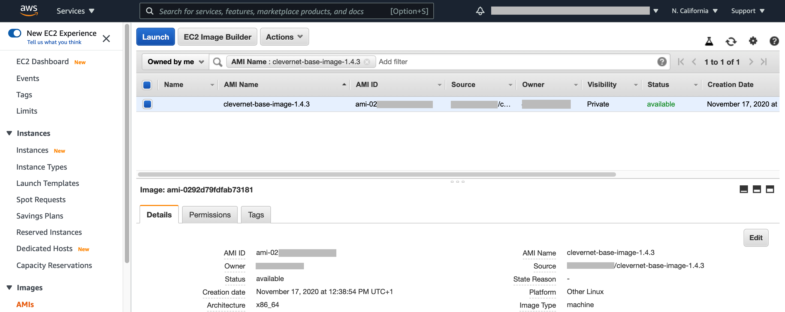

Once the AMI is selected we can launch it in EC2, following the minimum
requirements listed previously; the final summary of the instance launch is
shown in the following:

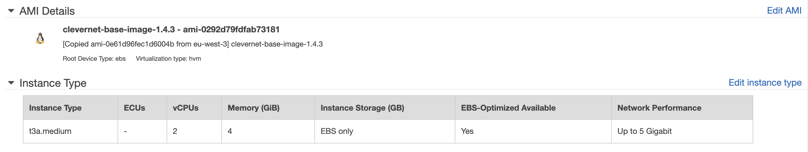
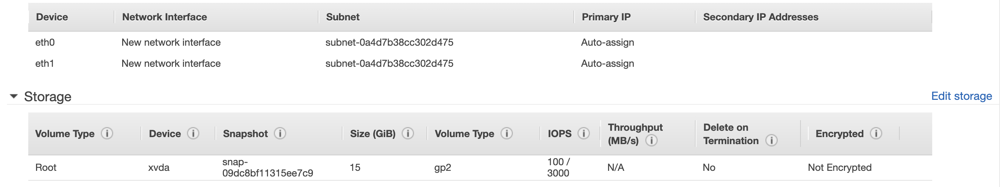

The security group should include only SSH on port 22 to allow the instance
to be configured remotely. Be sure to launch the instance with a freshly
generated key or a key that you already have.

To be noted also that, having the instance two vNICs, it is not possible to
auto-assign a public IP to any of the two before launching it. If you need the
public IP to access the instance through the Internet, be sure to assign and
associate an Elastic IP to the CVA WAN interface (the one connected to the
flexiEdge LAN interface).

More documentation on AWS EC2 can be found
[here](https://docs.aws.amazon.com/AWSEC2/latest/UserGuide/concepts.html),
while references to correctly prepare an AWS VPC with multiple subnets to
associate to EC2 instances can be found
[here](https://docs.aws.amazon.com/vpc/latest/userguide/what-is-amazon-vpc.html).

## Configuring the CVA in the Clevernet Cloud Dashboard
Once the instance is deployed you will need to configure it in the Clevernet
dashboard and provision it. As of today the company and users onboarding must be
performed by the Clevernet team by [contacting us](mailto:support@clevernet.io).
The Clevernet support team will provide you with your user credentials; you will
also need the communicate to support the number and names of the instances you
plan to deploy.

1. Once you obtained your access credentials you can access your company
  dashboard at https://console.clevernet.io . We recommend to reset the password
  provided by the team on first login.

  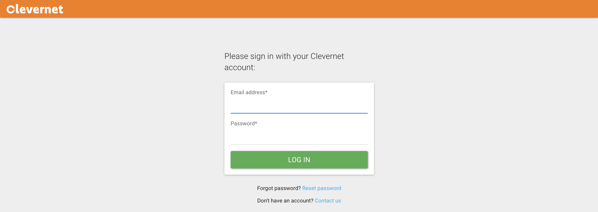

2. Select "ADMIN" tab from the top menu, and select the CVA (Box) to setup:

  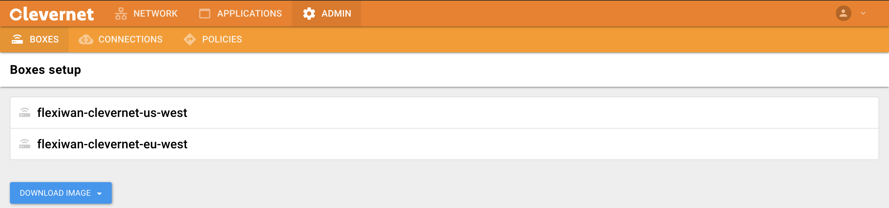

3. Select the interface to configure:

  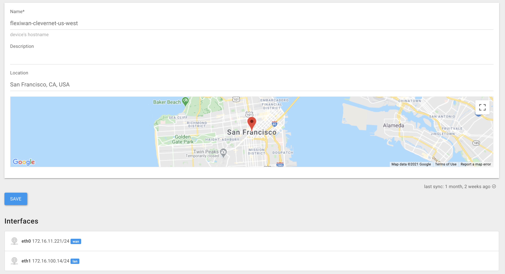

4. Fill the fields required to configure the interface by following the AWS
   deployed instance configuration; for WAN interfaces remember to specify the
   interface IP and default gateway, and a DNS server. If the WAN interface is
   NATed behind a public IP (as it is the case for AWS deployed instances), be
   sure to specify the public IP in the dedicated section. Remember to save the
   changes with the dedicated button at the end.

  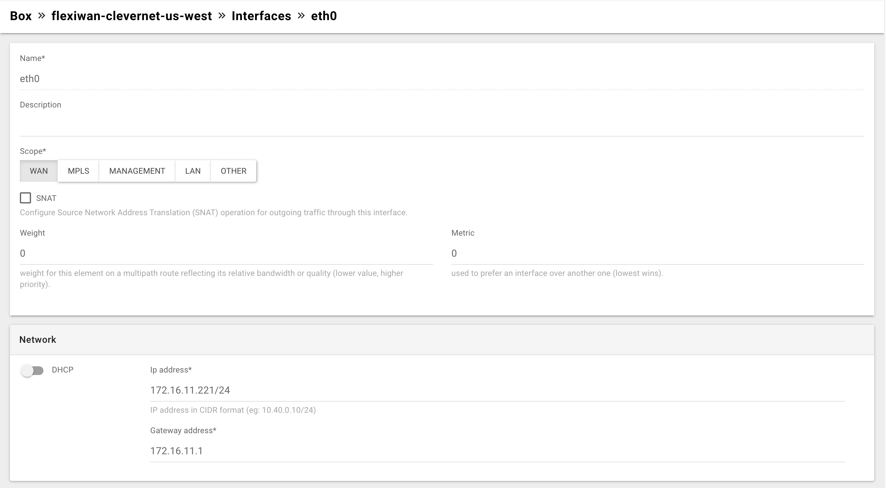
  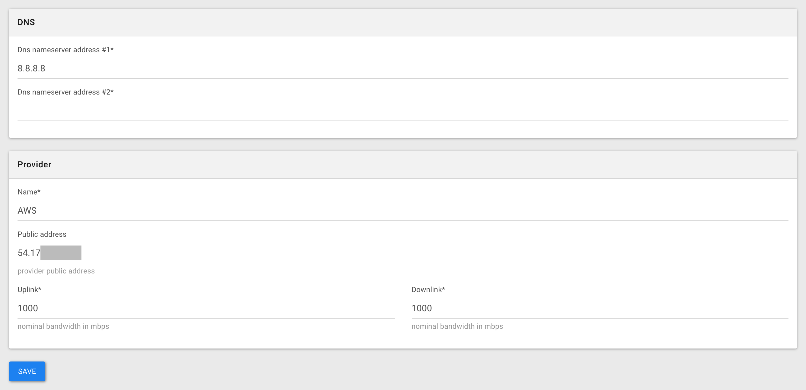

5. Repeat the three previous steps to setup all interfaces of the selected CVA.

6. Go to the "POLICIES" submenu and add any TCP application to optimize through
   Clevernet solution:

  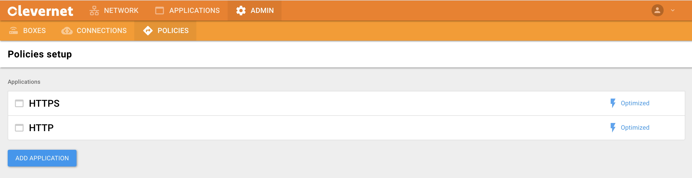

7. Specifiy the TCP port and additional settings for the application you want to
  optimize:

  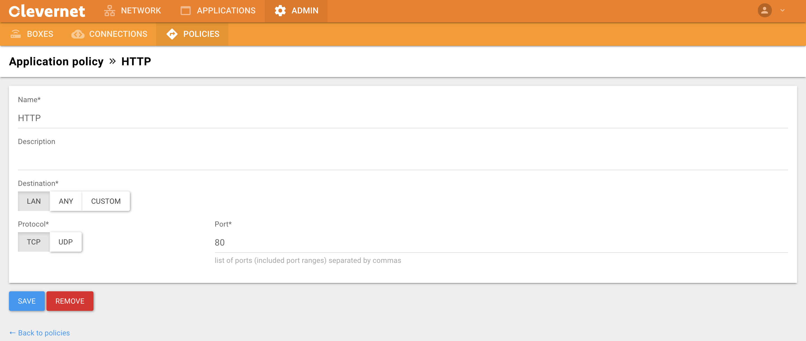

8. Repeat the last two steps for each TCP application port you want to be
  optimized.

## Provision the deployed CVA
To continue this walk-through you will have to connect to your CVA running in
AWS EC2 through SSH as ```customer``` user. If you are deploying in another
environment be sure to obtain access to a serial console of the VM where you can
login.

9. Login with the default customer credentials (user: customer - password:
  customer) and change the password:

  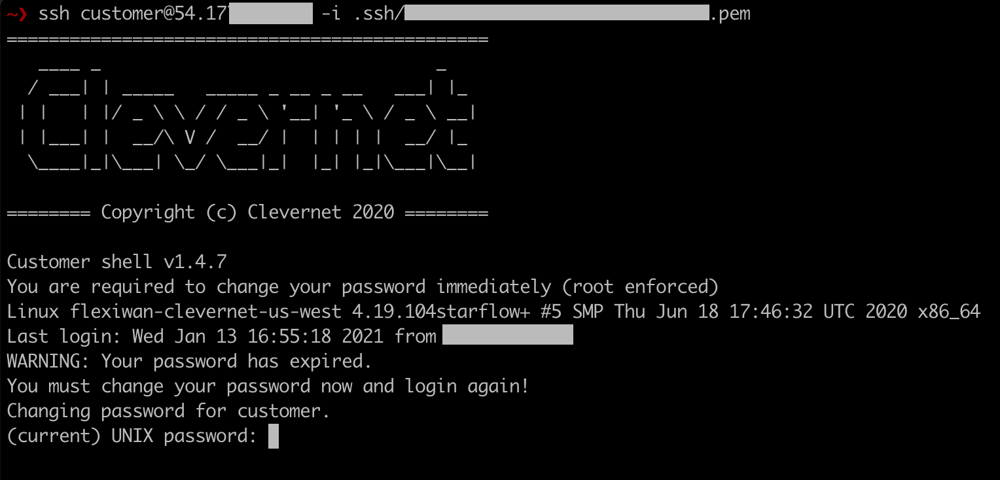

10. A network auto-discovery process will detect if CVA has Internet access
    (e.g., provided by any DHCP server - that is the case if you deployed in
    AWS). If so, go to step 12. If not, it is necessary to configure manually
    one of the available network interfaces in order to connect to the Clevernet
    Cloud Dashboard. Select "Management Network Configuration" from
    the CVA shell menu:

  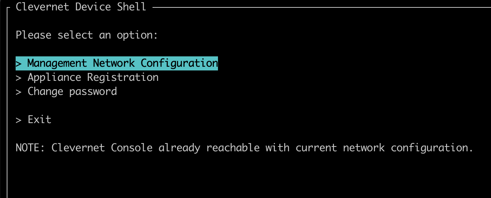

11. Select any of the available network interfaces listed and complete the
    fields requested to setup temporarily Internet access to any of them. It is
    recommended to use a publicly reachable nameserver such as 8.8.8.8. The CVA
    shell will test for Internet connectivity, and return to the menu:

  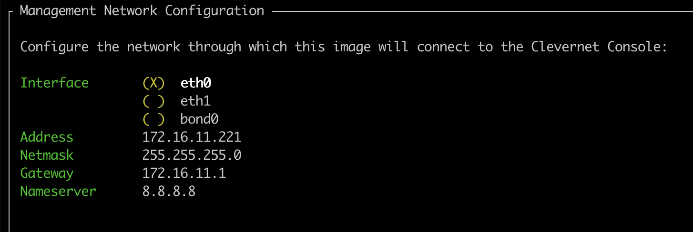

12. Select "Appliance Registration" from the CVA shell:

  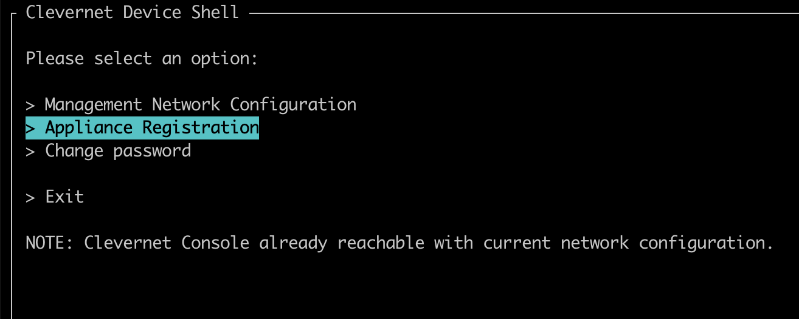

13. Log in with the Clevernet Cloud Dashboard credentials for your organization:

  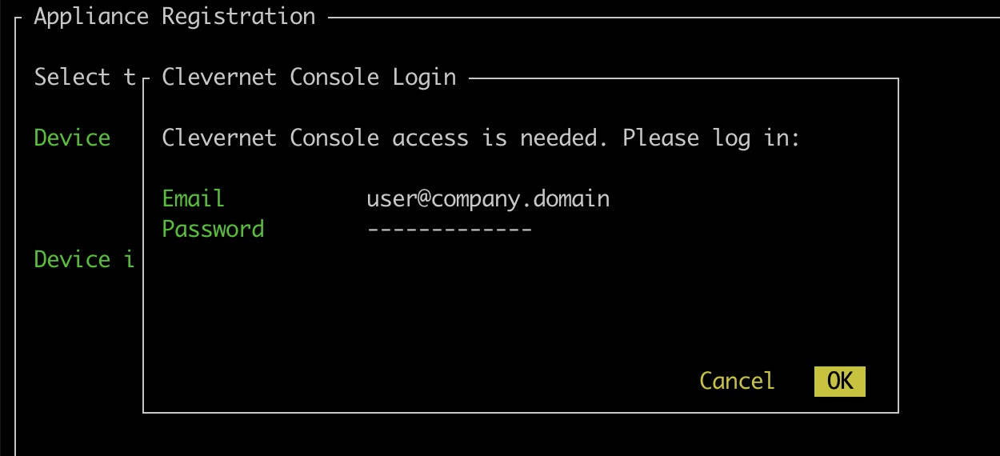

14. Select which CVA to register from the list:

  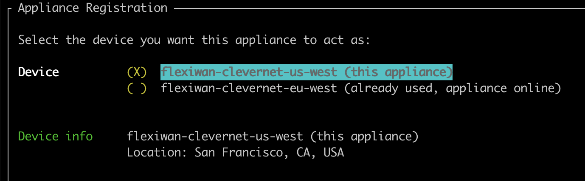

15. Confirm the registration before starting the configuration:

  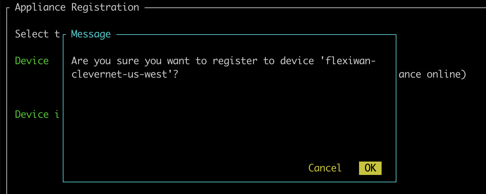

16. Wait for the configuration to be enforced (this could take up to 5 minutes):

  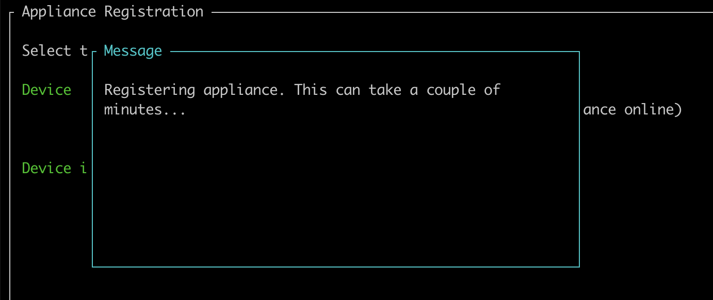

17. That's it! If everything went as expected the process will finish with a
    success message:

  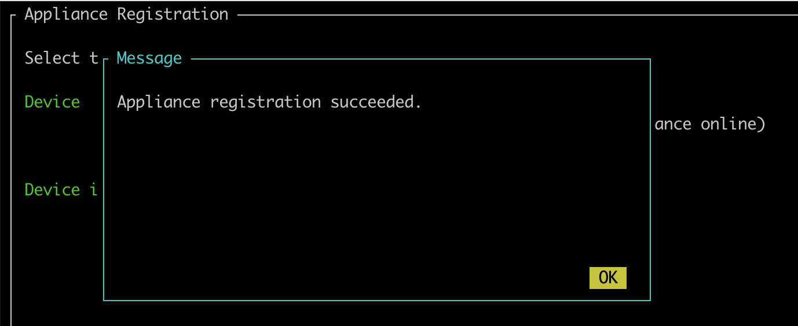

## Installing the flexiEdge agent
At this point each of your site has the Clevernet technology enabled, however
they are still not able to communicate between themselves. To this end we will
install and configure the flexiWAN solution in each one of them.

The flexiWAN software agent that will be deployed in the site is distributed as
a software package called flexiEdge; it has to be installed in a Linux Ubuntu
18.04 operating system. For the full documentation on installing flexiEdge in a
virtualized environment or bare metal you can follow [this
link](https://docs.flexiwan.com/installation/vm-bm-installation.html).

When deploying flexiEdge in the AWS public cloud consider that in the AWS
marketplace it is possible to find a community AMI with Ubuntu 18.04 LTS, and it
is then possible to install flexiEdge on top of it. We advice however, to follow
the complete flexiEdge installation guide for AWS that can be found at [this
link](https://docs.flexiwan.com/installation/aws-installation.html). This guide
simplifies considerably the setup process in AWS, automating it through Ansible
playbooks.

## Configuring the nodes in flexiManage and register them
Once flexiEdge is deployed in the site nodes, you will need to configure it in
flexiManage. First thing, you will need to [register your organization and a
first user account](https://docs.flexiwan.com/management/management-login.html).
More on account management in flexiManage can be found
[here](https://docs.flexiwan.com/management/users.html).

The next step is to generate device tokens to register the flexiEdge devices and
associate them with your account. This is the last step where you need SSH
access to the flexiEdge node, as you will have to paste the generated token in
the file ```/etc/flexiwan/agent/token.txt```.

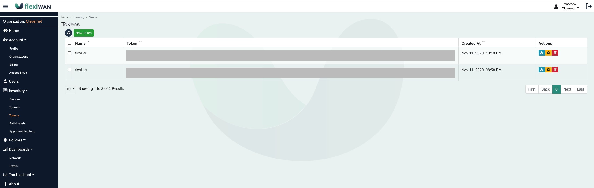

The node will then auto-register and will appear in your flexiManage account.
For a detailed step-by-step guide for this process you can refer to the original
flexiWAN documentation at [this
link](https://docs.flexiwan.com/management/device-mgmt.html). Once the devices
are registered be sure to enable the virtual router by pressing the play button
in the Devices section of the inventory.

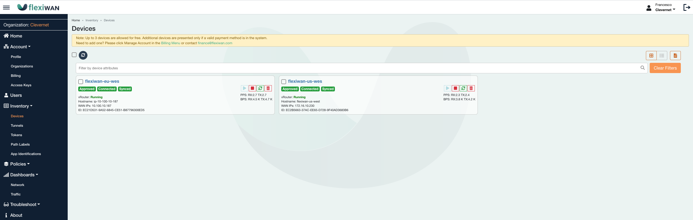

## Establishing the VPN tunnel to connect your sites
The final step to connect your sites it to establish a VPN tunnel between them
through flexiWAN. Creating tunnels is straighforward, just select the devices
in the Devices section and then select "Create Tunnels" from the "Actions" menu.

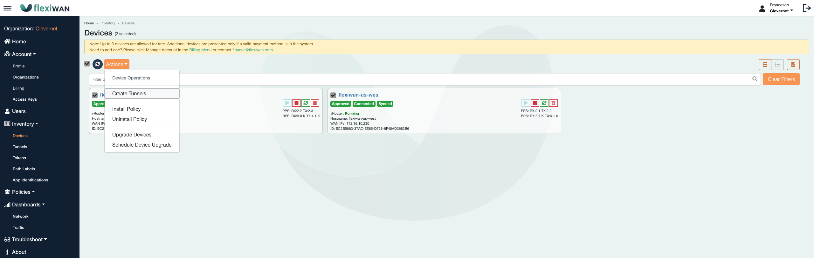

You are done! The flexiWAN system automatically declares the accessible LAN
devices (the CVAs) by announcing the route through the OSPF routing protocol.
You should be able to reach hosts in each site LAN.

The complete guide to establish VPN tunnels in flexiWAN is available
[here](https://docs.flexiwan.com/management/tunnels.html).

